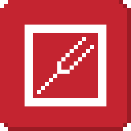

# BlockTuner (Forge Mod)

This is the forge version of BlockTuner. 

If you want a fabric version, please visit [this page](https://github.com/xwjcool123/BlockTunerMod).

If you want the data pack for older versions of Minecraft, please visit [this page](https://github.com/xwjcool123/blocktuner).

## Instructions

### Installation

Put this mod in your `mods` folder. You also need to install [Forge API](https://files.minecraftforge.net/net/minecraftforge/forge/) if you haven't installed it yet.

Server need to install the mod for it working.

You can get the latest version [here](https://github.com/APeng215/BlockTuner-forge/releases/latest) or find a specific release [here](https://github.com/APeng215/BlockTuner-forge/releases)

### How to Use BlockTuner

`Ctrl` + `Right click` on a note block to open up tuning UI. Placing a note block while holding `Ctrl` also opens the UI automatically.

`Ctrl` to show the note of the note block at crosshair.

`Ctrl` + `Middle click` on note blocks to pick up readily tuned note blocks.

Right click note blocks with blaze rods to play with right clicks without tuning.

### Tuning UI

Top-right corner (from left to right)

*  Play mode - toggle whether the GUI will turn off immediately upon clicking a note on the piano keyboard.
*  Typing keyboard to piano keyboard - toggle whether you want to play the piano keyboard using your computer keyboard.
*  MIDI Device - Click to cycle through available MIDI input devices. The icon shows red if the device is currently unavailable. This usually means it is being used by another program.

### Keyboard Mapping:

## Credits

### Original author 

* Fabric version original author - [xwjcool](https://github.com/xwjcool123)

### Localization

* Russian - [Felix14-v2](https://github.com/Felix14-v2) (Currently outdated)
* Japanese - [misaka10843](https://github.com/misaka10843) & [hakkaku](https://note.com/hakukak/)

